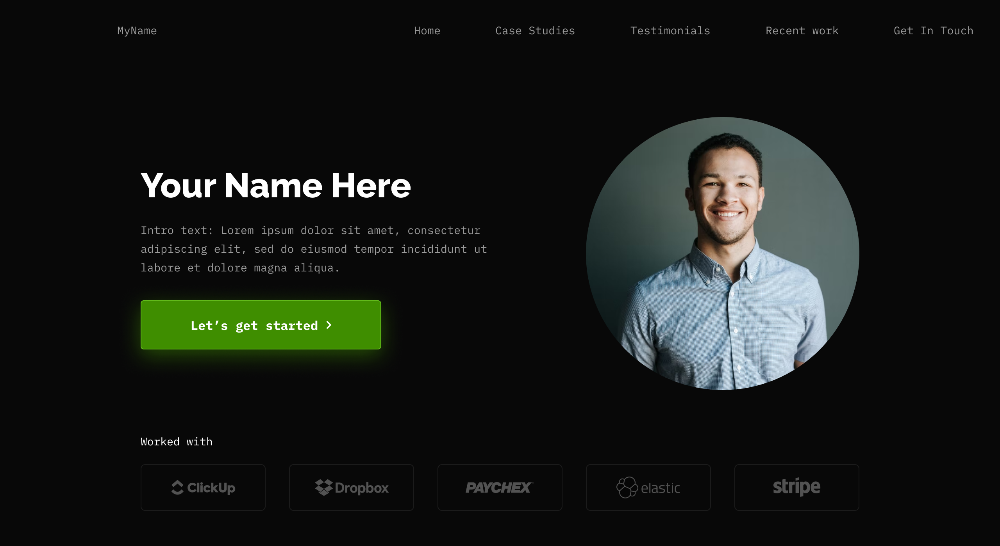

# Portfólio

## Link do site 
- https://portfoliolab-breno-production.up.railway.app/

## Descrição
Este projeto consiste no desenvolvimento de um portólio profissional onde será mostrado minha trajetória, habilidades, projetos e formas de contato de maneira moderna
e acessível.

## Integrantes
- Breno de Oliveira Brandão 
- Nicolas Almeida Prado da Silva	
- Pedro Augusto Santos Seabra	

## Professor
- João Paulo Carneiro Aramuni

## Tecnologias utilizadas
- Svelte, Railway, Figma, GitHub
 
## Relação das dependências e bibliotecas/frameworks usados
- Svelte, Tailwind, Lucide, Daisyui, nodemailer


## Estrutura de diretórios do projeto
```
static/
  //TODAS IMAGENS UTILIZADAS
src/
  app.html
  app.css
  routes/
    +layout.svelte   ← layout base (header/nav/main/footer)
    +page.server.ts  ← Lógica no servidor para envio de email usando nodemailer
    +page.svelte     ← página inicial com seções: home, sobre, projetos, experiências, contato
    projetos/
      +page.svelte   ← página com todos projetos
      +page.server.ts ← Fazendo loading de todos projetos pelo server e retornando pro +page.svelte
      [id]
        +page.svelte ← página de um projeto especifico
        +page.server.ts
  lib/
    components/
       //TODOS COMPONENTES UTILIZADOS
    utils/
      //ARQUIVOS COM FUNÇÕES DE UTILIDADE GLOBAL
     
    
docs/
  images/ ← wireframes do portfólio

```
## Pré-condições de instalação e execução
1. É necessario ter node instalado na maquina e gerenciador pnpm
## Instruções de instalação e execução local
1. Clonar o repositório
2. Instalar dependências pelo terminal
   - `pnpm install`
3. Ambiente de desenvolvimento
   - `pnpm run dev`

## Wireframes no Figma
Fizemos apenas uma página com todas seções
### Seção Principal

### Seção contato

### Seção Sobre mim

### Seção Projetos

### Seção Experiências


**Descrição:** Layout dark theme com hero section, navegação fixa e seções organizadas (Sobre mim, Projetos, Experiências, Contato).
